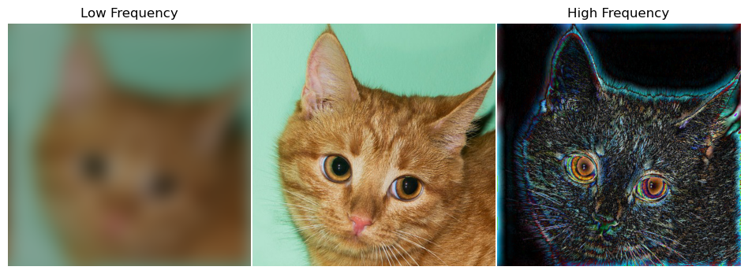
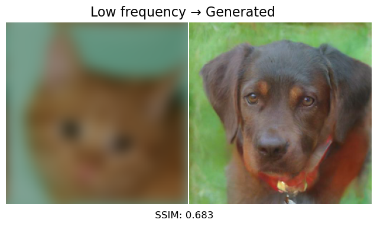
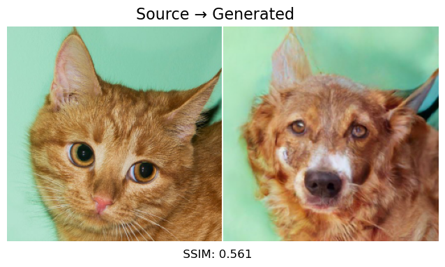
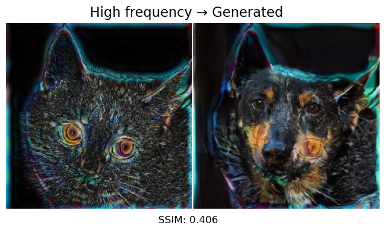
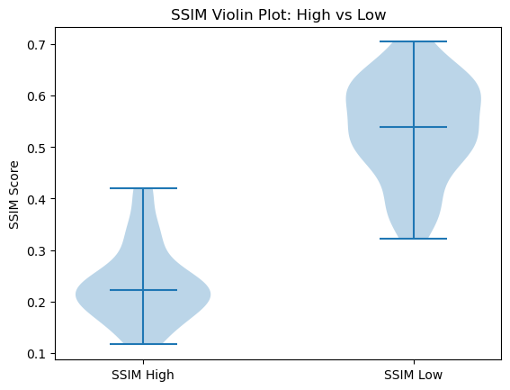
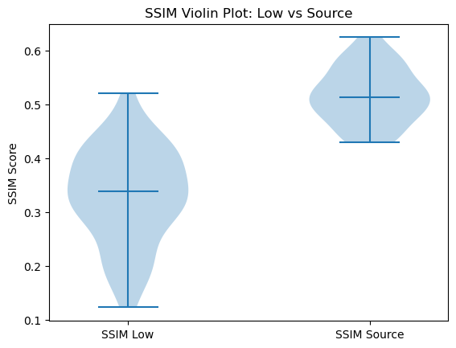
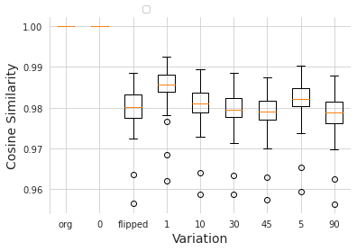
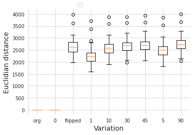

# Introduction:
Our research project aims to investigate the paper "Unifying Diffusion Models’ Latent Space, With Applications To Cyclediffusion And Guidance" ([Wu & De la Torre, 2022](https://arxiv.org/abs/2210.05559)). This paper proposes an alternative approach to the formulation of the latent space in diffusion models, which are instrumental in generative modeling, particularly in text-to-image models. Rather than using a sequence of gradually denoised images as the latent code, the authors propose using a Gaussian formulation, similar to the latent space used in Generative Adversarial Networks (GANs), Variational Autoencoders (VAEs), and normalizing flows. They also propose a DPM-Encoder, which can map images to this latent space.

The paper presents two main findings from this new formulation. First, they observe that a common latent space appears when two diffusion models are independently trained on related domains. This led to the proposal of CycleDiffusion, a method for unpaired image-to-image translation. In experiments, CycleDiffusion outperformed previous methods based on GANs or diffusion models. When applied to large-scale text-to-image diffusion models, CycleDiffusion enabled the creation of zero-shot image-to-image editors.

Second, the authors found that the new formulation allows for the guidance of pre-trained diffusion models and GANs using a unified, plug-and-play approach based on energy-based models. In demonstrations, it was shown that diffusion models have better coverage of low-density sub-populations and individuals than GANs when guided by the CLIP model and a face recognition model.

## Related work:
Generative models, specifically Generative Adversarial Networks (GANs) and CycleGANs, have been the foundation for many advancements in image synthesis and translation tasks. GANs, as proposed by Goodfellow et al., offer a way to generate artificial data that is similar to some given real data. They have been used extensively in image synthesis, style transfer, and super-resolution among other applications. However, GANs often suffer from training instability and mode collapse.

CycleGANs, introduced by [Zhu et al., 2017](https://arxiv.org/abs/1703.10593), provide an effective solution for unpaired image-to-image translation by learning to translate images from one domain to another and vice versa. Despite their success, CycleGANs might produce artifacts in the translated images due to the unsupervised nature of the learning process.

Diffusion models, on the other hand, propose a different approach to generative modeling. Instead of learning a direct mapping from a latent space to a data distribution, diffusion models learn to gradually transform a simple noise distribution into a complex data distribution. However, their use in image-to-image translation tasks has been limited.

The work by [Khrulkov & Oseledets, 2022](https://arxiv.org/abs/2202.07477) and [Su et al., 2022](https://arxiv.org/abs/2203.08382) bring deterministic diffusion probabilistic models (DPMs) into the spotlight by introducing an optimal transport framework. However, these works focus on deterministic DPMs and do not provide insights into the latent space of stochastic DPMs, which this paper investigates. This paper extends the capabilities of diffusion models and brings them in line with the versatility of GANs and CycleGANs, while addressing the limitations of previous methods.

## Methods: 
The paper presents a novel methodological approach by reformulating the latent space of diffusion probabilistic models (DPMs). The central premise behind this reformulation is to provide a unified perspective on pre-trained generative models, thereby potentially enhancing their application and efficacy.
The research introduces CycleDiffusion, an innovative technique that uses diffusion models for image-to-image translation tasks, similar to CycleGANs. The CycleDiffusion method is based on training two independent diffusion models on two distinct domains. The reformulation of the latent space allows these models to achieve impressive performance on unpaired image-to-image translation tasks.

For zero-shot image-to-image translation, text-to-image diffusion models are used. This provides the advantage of translating images without the need for paired data in the source and target domain, which is a significant step forward for generative models in scenarios where obtaining paired data can be challenging.

Moreover, the researchers have expanded the possibilities of diffusion models by defining a new type of latent code that allows these models to be guided similarly to GANs. This is achieved through a plug-and-play mechanism that does not require fine-tuning on noisy images, which is a typical requirement for GANs.

## Experiments and results:
In the paper, the authors conducted several experiments to validate the effectiveness of their proposed method, CycleDiffusion, particularly in the context of unpaired and zero-shot image-to-image translation tasks. The models were trained on two separate domains independently, emulating the typical structure of CycleGANs but utilizing the reformulated diffusion model concept.

The CycleDiffusion approach was shown to outperform other state-of-the-art models in the same tasks. The authors also demonstrated the versatility of their model by applying it to text-to-image translation tasks, where it again showed excellent performance.

In addition to these translation tasks, the authors also explored the capability of diffusion models to be guided in the same way as GANs without requiring finetuning on noisy images, a process they refer to as "plug-and-play." The results were again encouraging, suggesting that diffusion models could have broader coverage of sub-populations and individuals than GANs, opening new opportunities for more flexible and inclusive generative models.

# Analyzing weaknesses, strengths, and potential: our response
The paper presents a compelling approach to pre-trained generative models, introducing a reformulation of the latent space of diffusion probabilistic models (DPMs) that enhances their application and efficacy. This novel methodology, referred to as CycleDiffusion, demonstrated significant performance in unpaired image-to-image translation tasks and zero-shot image-to-image translation tasks. These are clear strengths of the paper, as they offer potential solutions to challenges inherent in these types of tasks, particularly where obtaining paired data can be difficult.

The proposed method's adaptability is another substantial strength. The defined latent code allows for diffusion models to be guided in a similar manner to GANs, introducing a plug-and-play mechanism that does not necessitate fine-tuning on noisy images. This could potentially open new avenues for using generative models in various applications.

However, the paper also presents certain weaknesses, which our group has identified and aimed to address. One area of concern is the semantic variability of the encoded seed. The paper does not provide detailed insights into the nature of the components being encoded—are they primarily high-frequency components, or is there a mix of frequencies? Furthermore, it is unclear how steering at different levels of noise impacts the semantics. In the context of generative models, "steering" refers to guiding or manipulating the model's output by adjusting its input or internal representations. It is a crucial aspect to understand for effective implementation and fine-tuning of these models.

Additionally, the limitations of the method have not been thoroughly explored, specifically the influence of the input prompt on the diversity and success rate of the generated outputs. Understanding these limitations is vital for refining the model and expanding its applicability.

## Research questions:
Given the aforementioned weaknesses of the paper, the research questions that we will answer in this project are the following:
- Are only high-frequency components being encoded?
- What is the impact of image transformations on the latent space?

These two questions should help us explore the semantic variability of the encoded seed.

# Novel contributions:
Our experiments, in the following sections aim to address the previously mentioned research questions. 
For this purpose, we have modified the source code provided by the authors of the paper and created demos in the form of Jupyter notebooks that demonstrate our experiments.

## Methodology:

### Encoding of high-frequency components
The focus of this research question is understanding which aspects of an image are the most important for the encoder. Our hypothesis is that high-frequency components are the most important (corners and edges). To test this, our method is to take an image and get two different versions of it: In one we apply a high pass filter (so it will only have high-frequency components), and in the other a low pass filter. Then we take the three images (the two edited images and the original) and encode them. If the encoded high-frequency image is more similar to the original encoded image than the encoded low-frequency image, it will mean that the high-frequency components of an image are the most relevant for the encoder. 

The images are transformed to the frequency domain using the Fast Fourier Transform (FFT), the frequency filter is applied, and then the images are converted back to pixel domain with the Inverse Fast Fourier Transform (IFFT). This will ensure that the encoder is given the same type of image it is used to. The frequency filter is a circle with a given radius (the value of which can be modified to change the aggressiveness of the filter), and some gaussian blur added to it, in order to make the filtered images smoother. 

This function is called [pass_filter](demos/RQ1_1.ipynb), and the best values for its radius have been found to be 10 for the high-pass filter and 5 for the low-pass filter. This means that all the frequencies between the radius 5 to 10 are neither on the high-pass nor the low-pass images, but this should not necessarily be a problem since we want to compare the extremes of the frequency domain. 

The format of the encoded latent space was found to be hard to compare as it is a long vector, but cosine similarity and other metrics were not useful in this case since we want to compare human visual perception. Thus, another way of comparing the latent spaces has been used. A decoder is used to decode the latent spaces of all three images, and the resulting generated images are compared to evaluate which generated images (high and low-frequency) are more similar to the original generated image. The decoder is deterministic, so the comparison of the generated images can be assumed to be equal to the comparison of the latent spaces. 

The comparison is done using a metric, since visual comparison can be subjective and unreliable. The used metric is SSIM, the same metric that is used in the original paper, since it is much better correlated with human visual perception ([Wang et al., 2004](https://www.cns.nyu.edu/pub/lcv/wang03-preprint.pdf)) than other numeric metrics such as mean squared error (MSE) or peak signal-to-noise ratio (PSNR). It takes into account both the structural information and the pixel values of the images, incorporating three main components: luminance, contrast, and structure.

### Impact of image transformations

Our contribution consists of a detailed analysis of the capabilities of the DPM-Encoder used in the task of unpaired image-to-image translation. The aim of this task is to generate a new image $\hat{x}$ from an input image $x$ that is very similar to the input image, but has a different domain. The CycleDiffusion framework involves encoding and decoding images through a shared latent space. The latent space, denoted as $z$ in the CycleDiffusion model, can be defined as follows:
$z \sim \text{DPMEnc}(z|x, G_1),\hat{x} = G_2(z)$

With the DPM-encoder defined as:
$x_1, ..., x_{T-1}, x_T \sim q(x_{1:T}|x_0), \epsilon_t = (x_{t-1} - \mu_T(x_t, t))/\sigma_t, t=T, ..., 1,$

$z := (x_t \oplus \epsilon_T \oplus ... \oplus \epsilon_2 \oplus \epsilon_1)$

Our investigation focuses on examining the impact of the input image $x$ on the corresponding latent code $z$. We do this for two different experiments. See `demos/RQ1_2.ipynb` for the notebook containing experiment 1 and 2.
Experiment 1 focuses on the impact on the latent code $z$ by horizontally flipping the image $x$. Experiment 2 focuses on the impact on the latent code $z$ that is caused by rotating the image $x$ by various angles.

### Experiment 1: horizontally flipping the images
Each image $x$ is horizontally flipped and fed into the CycleDiffusion model. The resulting latent space $z$ is stored after encoding. We compare the latent spaces of each original image with its horizontally flipped counterparts. The evaluation metrics employed for this comparison are the cosine similarity and the Euclidean distance.

### Experiment 2: rotating the images
We rotate the image $x$ for various angles, namely 0°, 1°, 5°, 10°, 30°, 45°, and 90°, to observe the influence of rotation on the latent space $z$ while using the same original image $x$. To mitigate information loss resulting from mere image rotation, we employ a preprocessing procedure. Each 512x512 image $x$ undergoes mirror padding with a width and height of 128. This step is necessary to maintain the integrity of the image, as depicted in the bottom figure. Subsequently, the image is rotated at each designated angle, thereby generating six additional input images for each original image.

This process is repeated for each original input image, and subsequently for each image angle. Firstly, all the original images are fed into the CycleDiffusion model, and the resulting latent space $z$ is stored after encoding. Next, we conduct the experiment for another rotation angle, and similarly store the corresponding latent spaces $z$ for all the rotated images. Finally, we compare the latent spaces of each original image with its rotated counterparts. The evaluation metrics employed for this comparison are the cosine similarity and the Euclidean distance. 

# Results: 

## Reproducibility

Gathering our experimental data has allowed us to compare the average similarity metric against the average mentioned in the paper. In the original paper the authors used the cat test set from the AFHQ dataset. The authors do not explicitly mention how many images they compared; However, we assume they used the entire test set. We compared 50 images, because of limited computational time. Our average SSIM score is 0.517, which is lower than the SSIM score of 0.557 in the paper. This is most likely because we did not use the entire test set.
Reproducibility was not the main focus of our paper, and we therefore did not work on reproducing any other results from the paper.

## Encoding of high-frequency components
The experiments have been carried out following the previously explained methodology. In total, 50 cat pictures from the database used in the original paper have been studied. As previously pointed out, for each of these images two new versions have been rendered:

These three versions have been encoded, and then decoded with a decoder trained on dogs.

The resulting generated images have the following form:

As one can observe, each image has been modified to adjust the decoded image “into” the input image. Nevertheless, this has more or less realistic results depending on the input: the decoded high-frequency images keep having most of their characteristics (odd color combinations and sharp edges), whereas the low-frequency images seem to lead to the most realistic results. 

The SSIM metric has been used to compare these images with each other (in pairs). The most relevant comparison is that of the generated dog (from the source image) with the generated high or low-frequency images: we are comparing the difference between generating an image from the original latent space, and generating one from a (indirectly) modified latent space. The resulting statistics for the comparisons between all generated images for the original batch of 50 images are the following:

|     SSIM Score    | Mean   | Standard Deviation | Min                | Max                |
|------------------------------------------|--------|--------------------|--------------------|--------------------|
|  Generated vs High Pass      | 0.2347 | 0.0744             | 0.1162  | 0.4197 |
| Generated vs Low Pass       | 0.5364 | 0.0958             | 0.3215 | 0.7048 |

This can be more clearly visualized with the following violin plots:

There is a clear difference in similarity between the generated image with high pass frequency filtering and low pass frequency filtering. Furthermore, it is also worth mentioning that the standard deviations are in similar ranges for both comparisons. 

The nature of the decoder is to denoise the input (the original and edited versions of cats) and generate an image in the target domain (a dog in this case). The result, as seen from the statistics, is that images generated from low-frequency cats are more similar to the normal generated images. This means that the decoder can generate a more realistic image in the target domain with a low-frequency input image compared to a high-frequency input image. 

The reason behind this is that the low-frequency image is more similar to noise than the high-frequency image. Therefore, there is not much characteristic information to begin with and as such the decoder is able to generate a more realistic image within the target domain. On the other hand, the high-frequency images have more characteristic information, so the denoising process is less effective at generating a realistic image from the input.

This can be further proven by comparing the similarity between the original cat and the low-frequency generated dog, and the original cat and the normal generated dog. The statistics are the following:

| SSIM Score     | Mean   | Standard Deviation | Min                | Max                |
|----------------------|--------|--------------------|--------------------|--------------------|
| Original cats vs generated low pass filtered dog | 0.3317 | 0.0883             | 0.1233| 0.5212 |
| Original cats vs generated dog                  | 0.5172 | 0.0509             | 0.4295| 0.6251  |

These can be visualized with a violin plot:

The original cat is more similar to the normal generated dog than to the low-frequency generated dog. Since the low-frequency cat image has less information than both the original cat and the high-frequency cat, the decoder can more effectively denoise the latent code of the image, and thus the resulting image is more similar to a dog than the original cat. 

From this explanation for the difference in similarities, it can be deduced that the higher frequency components of an image are more important, and therefore more predominant in the latent space of an image. 

## Impact of image transformations
In our study, we aim to analyze how the input image $x$ affects the corresponding latent code $z$. Our approach involves transforming the input image $x$ and then comparing the latent space of these transformed images with that of the original image. The transformations can be divided into two main categories: horizontal flipping and rotation at different angles. To assess the impact, we utilize two evaluation metrics, namely the cosine similarity and Euclidean distance.

The first figure shows the mean and standard deviation of the cosine similarity and the second the Euclidean distance between the original input images and the variations of the input images. The following tables show the exact values of the results shown in the figures.

|                 |  cos_sim |    euc_dist |
|----------------:|---------:|------------:|
|    variation    |          |             |
|     original    | 1.000000 | 0.000000    |
|     rotated0    | 1.000000 | 0.000000    |
| rotated0flipped | 0.979841 | 2643.239990 |
|     rotated1    | 0.985199 | 2255.402832 |
|    rotated10    | 0.980630 | 2592.262207 |
|    rotated30    | 0.979375 | 2676.824951 |
|    rotated45    | 0.978728 | 2719.694824 |
|     rotated5    | 0.981851 | 2506.610596 |
|    rotated90    | 0.978464 | 2735.980713 |

|                 |      cos_sim |   euc_dist |
|----------------:|-------------:|-----------:|
|    variation    |              |            |
|     original    | 8.403787e-08 | 0.000000   |
|     rotated0    | 8.403787e-08 | 0.000000   |
| rotated0flipped | 5.469230e-03 | 354.997901 |
|     rotated1    | 5.161229e-03 | 371.830091 |
|    rotated10    | 5.272746e-03 | 347.944196 |
|    rotated30    | 5.188180e-03 | 337.382562 |
|    rotated45    | 5.287351e-03 | 338.413821 |
|     rotated5    | 5.257743e-03 | 354.556911 |
|    rotated90    | 5.423888e-03 | 345.810448 |

The original image and the image rotated at 0° exhibit a cosine similarity of 1.0, implying consistent generation of the same latent representation by the model. This high cosine similarity suggests that the model consistently encodes the image into its latent space, indicating stability and reliability in its behavior. The Euclidean distance between these representations is 0.0, indicating an exact match and no variation between the original latent representation and the one derived from the same image. Therefore, we can confidently conclude that the model consistently and reliably encodes the image into its latent space.

Moreover, when examining the case of image flipping, we observe a mean cosine similarity of 0.98. This value indicates that the latent representations of the original image and its horizontally flipped counterpart exhibit similar features and patterns. It suggests that the flipped image representation can be obtained by applying a straightforward operation, such as a horizontal flip, to the original image's latent representation. However, the results also reveal a mean Euclidean distance of approximately 2643 for the flipped image. This indicates that the original image and its flipped version possess distinct latent representations. Consequently, flipping the image horizontally introduces significant changes in the latent space, and the flipped representation cannot be obtained merely through a direct transformation of the original image's latent representation.

The average cosine similarity of the rotated images at 90° is approximately 0.978. This indicates that, despite the 90-degree rotation, the latent representations still exhibit similar features and patterns. It suggests that the rotated image representation can be derived from the original image's latent representation, although some differences arise due to the rotation. In contrast, the average Euclidean distance for the image rotated at 90° is approximately 2735, indicating distinct latent representations between the images. Consequently, the 90-degree rotation introduces significant changes in the latent space, making it clear that the rotated representation cannot be obtained through a simple transformation of the original image's latent representation.

It is worth noting that cosine similarity primarily captures similarity in vector direction or orientation, but it may not encompass all aspects of similarity. When it comes to image rotation, although the orientation of features may change, other factors such as texture, color, and overall content could still be preserved, resulting in a relatively high cosine similarity. The same holds true for image flipping, where certain aspects of the image (e.g., texture, color) may remain intact while others (e.g., orientation, spatial arrangement) are altered. To gain a more comprehensive understanding of the specific similarities and differences between the original and flipped representations, further analysis or visualization of the latent spaces and corresponding images may be necessary. This would allow for deeper insights into the specific transformations and their effects on different image attributes.

# Conclusion:
In conclusion, our analysis of the semantic variability of the encoded seed in the CycleDiffusion model has provided valuable insights. Regarding the first research question, in which we examined the encoding of high-frequency components, our results indicate that the high-frequency components of an image play a more crucial role in the encoding process compared to low-frequency components. Removing the high-frequency components from an input image, leads to a more realistic generated image at the cost of visual similarity to the input image. In other words, the generated image loses the characteristic features of the input image when high-frequency components are removed.

The second research question focused on analyzing the impact of input image transformations on the corresponding latent code. By examining horizontal flipping and rotation at various angles, we utilized cosine similarity and Euclidean distance as evaluation metrics. We found that the model consistently encoded the original image into its latent space, implying that the model is stable and reliable. However, when exploring image flipping, the results suggest that the flipped representations shared similar features according to the cosine similarity, but distinct latent representations according to the Euclidean distance. Similarly, image rotation seems to preserve some of the features according to the cosine similarity, but the Euclidean distance results indicate substantial changes in the latent space. In summary, this research demonstrates that while the model exhibits stability and reliability in encoding images into their latent space, image transformations such as flipping, and rotation introduce significant changes in the latent representations. This indicates the importance of considering various aspects beyond orientation when analyzing similarity in the latent space. 

Overall, the analysis of the semantic variability of the encoded seed contributes to a more comprehensive understanding of the CycleDiffusion model. With our two research questions, we have seen that high-frequency components of an image are crucial in preserving the characteristic features of an image and applying geometric transformations to an image has a significant influence on the encoded latent space.

# Student contributions:
Alon Shilo
- Worked on the first research question, together with Philip and Quim. 
- Helped set up the dependency notebook with Francesco.
- Implemented low/high pass filter for our experiments.
- Worked on the pipeline of our notebook, which consists of 3 different experiments for comparing images with the SSIM metric.
- Structured the GitHub repo and cleaned some of it.

Dionne Gantzert
- Worked on the second research question, together with Francesco.
- Discussed and reported the method of the second research question in the blogpost.
- Studied and reported the results of the second research question in the blogpost.
- Conducted investigations on evaluating the latent space.
- Preprocessed the input images.

Francesco Tinner
- Worked on the second research question, together with Dionne.
- Helped set up the dependency notebook with Alon.
- Set-up CycleDiffusion on Lisa to be able to run experiments on the GPU cluster.
- Implemented modifications to the source code in order to run our own experiments.
- Worked on RQ1_2 notebook.

Philip Schutte
- Worked on the first research question, together with Alon and Quim.
- Modified the source code of the CycleDiffusion paper such that we could run our own experiments.
- Developed the experimental setup and made sure that it worked properly.
- Gathered all the generated images by running the experimental setup.

Quim Serra Faber
- Worked on the first research question, together with Philip and Alon. 
- Implemented low/high pass filter for our experiments.
- Wrote the general parts of the blogpost
- Studied and reported the results of the first research question in the blogpost
